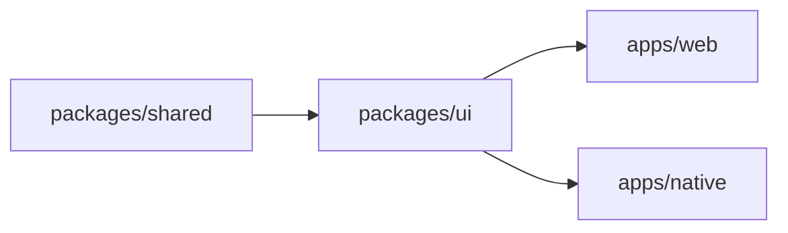

# Robo-Fleet Control — Codebase Summary

## Overview

React 19 + TypeScript Turborepo monorepo with shared UI library (`packages/ui`), type definitions (`packages/shared`), and dual deployment targets (web + Tauri desktop). Total ~7,400 lines of TypeScript across 49 files.

## Monorepo Structure

```
robo-control-app/
├── apps/
│   ├── web/              (@robo-fleet/web)      [thin shell, ~60 LOC]
│   └── native/           (@robo-fleet/native)   [thin shell, ~90 LOC]
├── packages/
│   ├── ui/               (@robo-fleet/ui)       [~4500 LOC, components + services]
│   ├── shared/           (@robo-fleet/shared)   [~400 LOC, types + constants]
│   ├── tsconfig/         [shared TypeScript configs]
│   └── eslint-config/    [shared ESLint rules]
├── src/                  [legacy pre-monorepo, still active]
├── src-tauri/            [Rust Tauri backend, minimal]
└── docs/                 [architecture, guides, PDR]
```

### Package Details

| Package | Purpose | LOC | Files |
|---------|---------|-----|-------|
| `packages/ui` | Components, hooks, services, adapters | ~4500 | ~30 |
| `packages/shared` | Types (socket, commands, telemetry), constants | ~400 | ~10 |
| `apps/web` | Vite entry point, environment config | ~60 | ~4 |
| `apps/native` | Tauri v2 entry point, IPC setup | ~90 | ~6 |
| `src/` | Legacy root-level app (pre-refactor) | ~7400 | 49 |

## File Inventory by LOC (Top 20)

| File | LOC | Purpose |
|------|-----|---------|
| `src/components/CameraViewer.tsx` | 1115 | JPEG video streaming, Canvas detection overlays, click-to-track |
| `src/components/pages/RoboRoverControl.tsx` | 895 | Main page controller, Socket.IO connection, all state, command emission |
| `src/styles/globals.css` | 372 | Tailwind v4 theme, glass-morphic utilities, semantic colors |
| `src/components/LocationMap.tsx` | 449 | 2D canvas path visualization, zoom/pan, wheel kinematics |
| `src/components/VoiceControls.tsx` | 432 | TTS playback, authoritative config sync, walkie alerts, browser STT |
| `src/components/FloatingMetrics.tsx` | 323 | Performance panel: latency, FPS, memory, CPU per-robot |
| `src/components/TranscriptionDisplay.tsx` | 193 | Speech recognition result display |
| `src/types/index.ts` | 187 | Shared type exports |
| `src/components/organisms/FleetSelector.tsx` | 184 | Multi-rover selector with health metrics |
| `src/App.tsx` | 143 | Root component, RoboRoverControl entry point |
| `src/components/organisms/JointControlPanel.tsx` | 134 | 6 arm joint sliders, position validation |
| `src/constants/index.ts` | 127 | JOINT_LIMITS, class color maps, helpers |
| `src/components/atoms/StatCard.tsx` | 98 | Stat display card component |
| `src/components/molecules/SliderControl.tsx` | 94 | Reusable slider with labels |
| `src/components/organisms/DraggablePanel.tsx` | 89 | Movable/resizable panel wrapper |
| `src/components/molecules/CollapsibleSection.tsx` | 78 | Toggle-show/hide section |
| `src/types/commands.ts` | 76 | Rover/arm/tracking command types |
| `src/types/telemetry.ts` | 73 | Rover/arm/servo telemetry types |
| `src/components/atoms/BatteryIndicator.tsx` | 71 | Battery % display with color coding |
| `src/components/atoms/StatusBadge.tsx` | 64 | Status label with icon |

## Component Hierarchy (Atomic Design)

### Atoms (Single Responsibility)
- `BatteryIndicator` — Battery % display with thresholds (green/yellow/red)
- `StatusBadge` — Status label (connected, disconnected, error) + icon
- `ToggleButton` — Binary switch component
- `LoadingSpinner` — Animated loading indicator
- `IconBadge` — Icon + text label combination
- `StatCard` — Metric display card (value + unit + optional trend)
- `ValueDisplay` — Key-value pair display

### Molecules (Composite)
- `SliderControl` — Slider with min/max labels
- `ToggleControl` — Toggle switch + label
- `StatPanel` — Multiple stats in a card
- `CollapsibleSection` — Toggle-show/hide expandable panel
- `InputWithAction` — Text input + action button (e.g., preset name input)
- `AnimationControls` — Animation speed/loop controls
- `PosePresetSelector` — Dropdown for saved arm poses

### Organisms (Complex Interaction)
- `JointControlPanel` — 6 sliders for arm joints + home button
- `FleetSelector` — Rover list selector with battery/connection status
- `DraggablePanel` — Draggable/resizable window container
- `ServerSettings` — Backend connection config form
- `URDFViewer` — 3D robot model visualization (Three.js)

### Features (Full Features)
- `CameraViewer` — Live JPEG streaming + detection overlays + click-to-track
- `LocationMap` — 2D canvas rover path visualization
- `VoiceControls` — Manual TTS, walkie-talkie controls, browser-private voice command capture, authoritative STT status/profile display, TTS config convergence, and voice alerts
- `FloatingMetrics` — Floating performance metrics panel
- `TranscriptionDisplay` — Fleet rover transcription history with rover badge, profile/language metadata, and null-safe confidence

### Pages
- `RoboRoverControl` — Main controller page (self-contained state + Socket.IO)
- `URDFVisualizationPage` — Robot model 3D viewer (secondary page)

## Key Files by Domain

### Socket.IO & Communication
- `packages/shared/src/types/socket.ts` — Typed event maps, including `stt_status`, `voice_command_transcription`, `auth_error`, and `command_ack`
- `packages/shared/src/types/voice.ts` — Shared STT/voice contract types and compile-time fixture verification
- `packages/ui/src/components/pages/RoboRoverControl.tsx` — Socket.IO connection setup, browser-private vs rover-public transcription state, TTS config/alert replay handling

### Commands & Telemetry
- `src/types/commands.ts` — WebRoverCommand, WebArmCommand, TrackingCommand
- `src/types/telemetry.ts` — RoverTelemetry, ArmTelemetry, TrackingTelemetry, SystemMetrics
- `src/types/voice.ts` — SpeechTranscription, TTSMessage, AudioFrame types
- `src/types/fleet.ts` — FleetStatus, RoverStatus, RoverHealth

### Styling & Theme
- `src/styles/globals.css` — Tailwind v4 config, custom utilities, color tokens
- Custom classes: `.glass-card`, `.glass-card-blur`, `.btn-*`, `.status-glow-*`

### Constants & Helpers
- `src/constants/index.ts` — JOINT_LIMITS (per servo), DEFAULT_CLASS_COLORS, createHomePosition(), validateJointPositions()
- `src/types/index.ts` — Re-exports all types for convenience

### Hooks
- `packages/ui/src/hooks/use-browser-voice-capture.ts` — Browser STT transport lifecycle, frame batching, and exact-once stop/cleanup
- `src/hooks/index.ts` — Legacy/root-level custom hooks

### Services (Pattern B — extensible, not yet active)
- `src/services/` — Service factory interfaces, could include:
  - `ISocketService` — Abstract Socket.IO connection
  - `IRoverCommandService` — Command emission
  - `ITrackingService` — Detection overlay management
  - `IFleetService` — Fleet selection logic
  - `ITelemetryService` — Telemetry aggregation
  - `IMediaService` — Camera/audio stream handling
  - `IVoiceService` — TTS/STT orchestration

## State Management

**No Redux/Zustand.** All state in `RoboRoverControl` via useState hooks:

```typescript
// Connection
const [connection, setConnection] = useState<ConnectionState>({ ... })

// Telemetry
const [armTelemetry, setArmTelemetry] = useState<ArmTelemetry | null>(null)
const [roverTelemetry, setRoverTelemetry] = useState<RoverTelemetry | null>(null)

// Speech
const [browserVoiceHistory, setBrowserVoiceHistory] = useState<SpeechTranscription[]>([])
const [roverTranscriptionHistory, setRoverTranscriptionHistory] = useState<SpeechTranscription[]>([])
const [sttStatus, setSttStatus] = useState<SttStatus | null>(null)

// Fleet
const [fleetStatus, setFleetStatus] = useState<FleetStatus | null>(null)

// Metrics (per-robot)
const [performanceMetrics, setPerformanceMetrics] = useState<Map<string, SystemMetrics>>(new Map())
```

State flows down as props to feature/organism components.

## Type System

**Location**: `src/types/` (legacy) and `packages/shared/src/types/` (future consolidation)

**Core types**:
- `ConnectionState` — isConnected, clientId, command counts
- `WebRoverCommand` — { type, vx, vy, omega, timestamp }
- `WebArmCommand` — { servos: [joint1, joint2, ...], timestamp }
- `RoverTelemetry` — { position, velocity, batteryPercent, temperature, ... }
- `ArmTelemetry` — { servoPositions, loads, temperatures, ... }
- `TrackingTelemetry` — { detections: [{ bbox, className, confidence }, ...] }
- `SystemMetrics` — { commandLatency, fps, memoryUsage, cpuLoad }
- `SpeechTranscription` — Source-aware final transcription with profile/language, stream identity, authoritative rover targeting, and optional confidence
- `SttStatus` — Backend readiness state, startup profile, language, timestamp, and sanitized error text
- `FleetStatus` — { rovers: [{ id, health, status, battery }, ...] }

**Socket.IO event types** (`packages/shared/src/types/socket.ts`):
- Receive: video_frame, tracked_detections, servo_telemetry, rover_core_telemetry, arm_telemetry, transcription, voice_command_transcription, stt_status, performance_metrics, fleet_status, command_ack, auth_error
- Emit: rover_command, arm_command, tracking_command, fleet_select, audio_control, tts_command, audio_stream, voice_command_control, voice_command_audio, stt_status_request

## Dependencies

### Major Libraries
- `react@19.x` — UI framework
- `typescript@5.8` — Type safety
- `socket.io-client@4.8` — Real-time comms
- `tailwindcss@4.x` — Styling with `@tailwindcss/vite` plugin
- `lucide-react@latest` — Icon library
- `react-joystick-component@latest` — Joystick input
- `@tauri-apps/api@2.x` — Tauri IPC (desktop only)

### Dev Dependencies
- `turbo@2.5.4` — Monorepo build orchestration
- `vite@latest` — Bundler
- `eslint`, `prettier` — Code quality

## Build Pipeline (Turborepo)



**Tasks**:
- `dev` — Concurrent dev servers for all apps (Vite HMR)
- `build` — Production bundles for web + Tauri
- `check-types` — TypeScript type checking
- `lint` — ESLint across workspace

## Socket.IO Patterns

### Pattern A (Active) — Direct Socket Refs
Used in `RoboRoverControl.tsx`, `CameraViewer.tsx`:
```typescript
const socketRef = useRef<Socket>();
useEffect(() => {
  socketRef.current = io(SOCKET_URL, { auth: { username, password } });
  socketRef.current.on('event_name', handler);
  return () => socketRef.current?.disconnect();
}, []);
```

### Pattern B (Extensible) — Service Abstraction
Ready for future implementation via `ServiceFactory`:
```typescript
const socketService = getSocketService();
socketService.onTelemetry((data) => { ... });
socketService.emit('rover_command', { ... });
```

## Environment & Config

### .env Variables
- `VITE_SOCKET_IO_URL` — Backend URL (default: http://localhost:3030)
- `VITE_AUTH_USERNAME` — Basic auth username
- `VITE_AUTH_PASSWORD` — Basic auth password

### Vite Config (`apps/web/vite.config.ts`)
- Path alias: `@robo-fleet/ui` → `../../packages/ui/src`
- Tailwind CSS v4 plugin integration
- Development server on port 25010

### Tauri Config (`src-tauri/tauri.conf.json`)
- App window on port 1420
- IPC whitelist (placeholder for future commands)
- Dev server URL → Vite dev server

## Styling Details

### Tailwind v4 Integration
- Uses `@tailwindcss/vite` plugin (CSS-first config, no JS needed)
- All theme customization in `src/styles/globals.css`
- Fonts: IBM Plex Sans (body), JetBrains Mono/Fira Code (mono)
- Colors: Terminal/IDE dark theme (slate, indigo, cyan accents)

### Custom CSS Classes
- `.glass-card` — Glassmorphic panel (blur + semi-transparent)
- `.glass-card-blur` — Higher blur variant
- `.gradient-bg` — (Background pattern placeholder)
- `.btn-primary`, `.btn-secondary`, `.btn-success`, `.btn-danger` — Button colors
- `.status-glow-active`, `.status-glow-disconnected` — Status indicators
- `.scanline-effect` — Retro scanline overlay

## Notable Implementation Details

### CameraViewer (1115 LOC)
- JPEG frame decoding: Blob → createObjectURL → canvas context.drawImage()
- Detection overlay: Canvas 2D API, bbox + label + confidence rendering
- Click-to-track: mapPixelToNormalizedCoord(x, y) → emit tracking_command
- Frame rate driven by Socket.IO `video_frame` event frequency

### RoboRoverControl (895 LOC)
- Socket.IO connection lifecycle (connect, disconnect, reconnect handlers)
- Command throttle: useRef<number> timestamp tracking, 100ms minimum between emits
- State aggregation: All telemetry/metrics collected, distributed via props
- Source-aware speech handling: private browser history is cleared on disconnect/auth errors, rover history remains fleet-scoped, and cached `stt_status` is restored after reconnect

### LocationMap (449 LOC)
- Canvas 2D path visualization, 50ms wheel kinematics integration loop
- Zoom/pan controls: requestAnimationFrame animation loop
- Coordinate transforms: world space → canvas space (scale, offset, rotation)

### VoiceControls + Voice Hooks
- Manual TTS: Binary PCM audio frames → Web Audio API AudioBuffer queue
- Browser voice commands: `use-browser-voice-capture` emits exact-once start/stop plus roughly 50 ms Float32 frames over `voice_command_*` events
- State split: browser-private transcript/status stays in `VoiceControls`; rover/fleet transcription stays in `TranscriptionDisplay`
- Cleanup: stop, disconnect, auth failure, mode switch, and unmount all release microphone, worklet, `AudioContext`, analyser, RAF, and object URLs

## Testing & Quality Assurance

**Current state as of 2026-07-03:**
- Vitest + Testing Library active for `packages/ui`
- UI lifecycle/state coverage added for browser capture, privacy split, reconnect cleanup, and null-confidence rendering
- ESLint configured and passing via `pnpm lint`
- TypeScript strict mode enabled and passing via `pnpm check-types`

**Remaining gaps:**
- Live microphone + backend browser E2E is still manual
- Service Factory pattern still available for broader component/hook mocking
- Playwright/Tauri E2E remains future work

## Deployment Targets

### Web (Vite)
- Static SPA serving on port 25010
- Browser compatibility: Chrome 120+, Firefox 121+, Safari 17+
- Build artifact: `dist/` (index.html + main.js + assets)

### Desktop (Tauri v2)
- Bundled with native window, runs on port 1420
- Minimal Rust backend (Tauri IPC framework only)
- Supported platforms: Windows (MSIX), macOS (DMG, Apple Silicon native), Linux (AppImage)

## Known Limitations

1. **Legacy src/ structure** — Old pre-monorepo root app still active; migration to packages/ ongoing
2. **Selective persistence** — Session token survives reconnect, but command and telemetry state do not
3. **No offline queue** — Commands dropped if disconnected; no retry logic
4. **Browser voice prerequisites** — Browser capture requires HTTPS or `localhost`, microphone permission, backend STT readiness, and a selected rover
5. **No browser E2E** — Vitest covers UI logic, but real microphone/backend end-to-end validation is still manual
6. **Single rover command target** — Only one active selected rover at a time for browser voice capture and manual control

## Next Steps

- Consolidate types into `packages/shared` (currently duplicated)
- Activate Pattern B service abstraction + add Vitest suite
- Implement auth (JWT tokens, refresh rotation)
- Add offline command queue + reconnection logic
- Create embedded component for glean-oak-app integration
